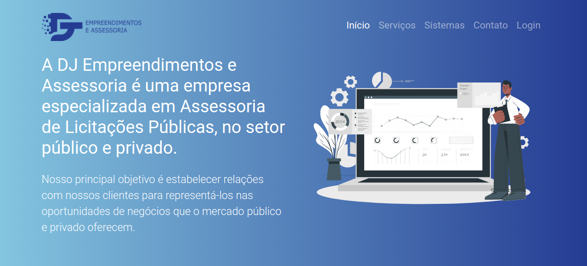
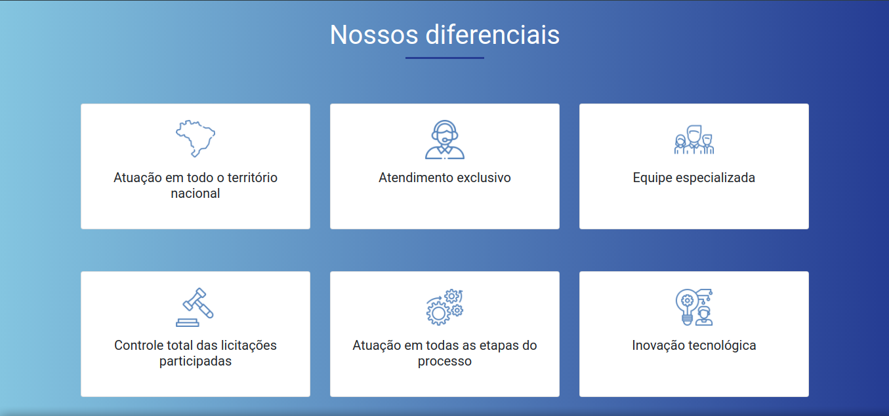
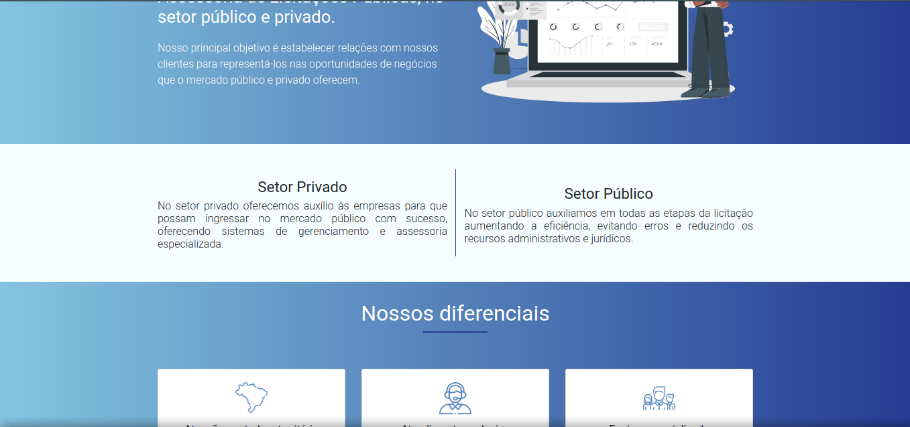
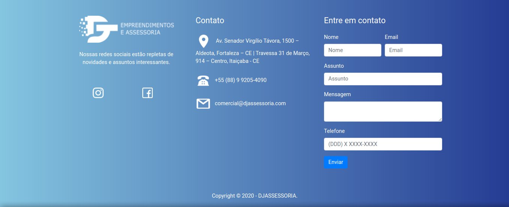

# Site djassessoria

# :rocket: Sobre o projeto

Landing page feita para a DJ Empreendimentos e Assessoria que é uma empresa especializada em assessoria de licitações públicas, no setor público e privado.

**VISITE EM: https://site-djassessoria.vercel.app/**

## :computer: Tecnologias utilizadas
* HTML
* CSS
* JAVASCRIPT

## :construction_worker: Projeto na sua máquina

**Só é necessário realizar o clone deste repositório a partir do seguinte comando:**

```
git clone https://github.com/kelsiane/site-djassessoria.git
```

URLs SSH fornecem acesso a um repositório Git via SSH, um protocolo seguro. Se você tiver uma chave SSH registrada em
sua conta do Github, clone o projeto usando este comando:

```
git@github.com:kelsiane/site-djassessoria.git
```

# :art: Layout

<br />
<p align="center">
  
</p>
<p align="center">
  
</p>
<p align="center">
  
</p>
<p align="center">
  
</p>

<br/>

# :unlock: Licença
Lançado em 2020. Este projeto está sob a licença do MIT .

Feito com muita dedicação por Kelsiane Lima :zap:
